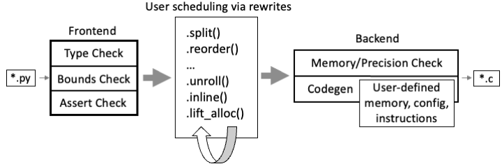

# System Overview

This document provides an overview of the Exo compilation process, as illustrated in Figure 1 of the PLDI'22 paper.

The Exo compiler consists of a frontend and a backend, with user schedules applied in between. The input to the compiler is a set of Exo source files (`*.py`), and the output is generated C code (`*.c`).

In this repository, folders are structured as follows:

1. `src/exo` is where the core Exo implementation resides.
    - **APIs.** Documentation for the APIs can be found in the [API documentation](docs/API.md).
      - `API.py` defines a stable API for top-level decorators (`proc`, `instr`, and `config`).
      - `API_scheduling.py` defines a API for scheduling primitives.
      - `API_cursors.py` defines a API for Cursors.
    - **Standard libraries.** These could be user-defined, but we provide them for convenience.
      - `libs/` contains some common memory definitions (`memories.py`) and custom malloc implementations. 
      - `platforms/` contains instruction definitions that are part of the release.
      - `stdlib/` contains user-level scheduling functions such as `vectorize`.
    - Other files are implementation details of Exo (e.g., `typecheck.py` implements typecheck), are not exposed to users.
2. `apps/` contains some sample applications written in Exo.
3. `dependencies/` contains submodules that Exo's apps and testing depends on.
4. `examples/` contains a step-by-step example of scheduling basic matrix multiplication on AVX2.
5. `tests/` contains the Exo test suite.
6. `docs/` contains additional Exo documentation.

---

## Core

`src/exo/core` defines IRs used in Exo and other core implementations.
- `LoopIR.py` is the main file that defines IRs (LoopIR, UAST, PAST), and their visitor functions (LoopIR_Do, LoopIR_Rewrite). 
- `LoopIR_pprint.py` implements a printing procedure for the IRs defined in `LoopIR.py`.
- `prelude.py` defines `Sym` and `Srcinfo` used in `LoopIR` and everywhere.

User-defined features like config, externs, and Memory's parent class implementations are in `configs.py`, `extern.py`, and `memory.py`, respectively.

`internal_cursors` defines cursor movements that are used internally by `LoopIR_scheduling` implementations of scheduling primitives.
`proc_eqv.py` defines a union-find tree which we use to track the equivalence of procedures.

---

## Frontend

`API.py` provides various user-facing entry points to Exo.
There are three types of parsing passes in the frontend. All the frontend code is in `src/exo/frontend`.

### Procedures

`@proc` and `@instr` decorators are defined here, which call into `Pyparser`.
The frontend works like: API -> Parser -> TypeCheck -> BoundsCheck/AssertCheck

`frontend/pyparser.py` defines a parser from Python AST to UAST/PAST. We don't implement our own lexer, but rely on the Python lexer to build a Python AST, and hijack it to translate it to Exo's internal ASTs. UAST is an "untyped AST" which is an untyped version of LoopIR (LoopIR is the "Exo IR" in the paper terminology). UAST is used when parsing the full procedure definitions (`@proc` or `@instr`). PAST is a pattern AST with holes, which is used to parse fragments from the user code not in the procedure, to parse arguments to the scheduling primitives (e.g., `n + m`).

`typecheck.py` literally typechecks but also converts UAST to LoopIR.
`boundscheck.py` checks any out-of-bounds errors in the frontend code. It also checks that all assertions in the code are satisfiable. It invokes an SMT solver.

### New LoopIR Expressions

Some scheduling primitives (such as `expand_dim`, all primitives that take `NewExprA` type as an argument) require the construction of new LoopIR expressions.
`parse_fragment.py` implements this pass. It calls into `pyparser.pattern` which invokes the parser with `is_fragment=True`.
It's not possible to use holes `_` when parsing new expressions. Holes are for pattern matching for reference.

### Pattern Match for Reference

Cursors can be obtained by pattern matching. The pattern gets parsed into PAST and then matched against the LoopIR to obtain a reference.
`frontend/pattern_match.py` implements this functionality.

---

## Rewrites (User-Scheduling)

After the frontend pass, we obtain LoopIR. Files in `src/exo/rewrite` implement Exo's rewrite-based user-scheduling process.
- `LoopIR_scheduling.py` is the main file that implements all the scheduling primitives. Many implementations of primitives call into `Check_...` functions, which are the safety checks implemented in `new_eff.py`.
- How we handle analysis to preserve functional equivalence of rewrites is a whole other topic we don't go into details here. `new_eff.py`, `new_analysis_core.py`, and `analysis_simplify.py` are all files related to the analysis.
- `LoopIR_unification.py` implements a unification process for supporting the `replace(p, ...)` rewrite primitive.

---

## Backend

The backend is responsible for lowering LoopIR to C code and performs backend checks like precision analysis, window analysis, and parallelism analysis.

- `LoopIR_compiler.py` is the main file in the backend, which compiles LoopIR to C code.
- `mem_analysis.py` implements a memory consistency check. For example, if a callee expects an `AVX2` annotation but the caller passes `DRAM` memory, it raises an error.
- `parallel_analysis.py` implements a parallel analysis. 
- `prec_analysis.py` implements a precision consistency check, but also coerces the precision where possible.
- `win_analysis.py` implements a window analysis to check if callee and caller window annotations (tensor or window) match with each other.
